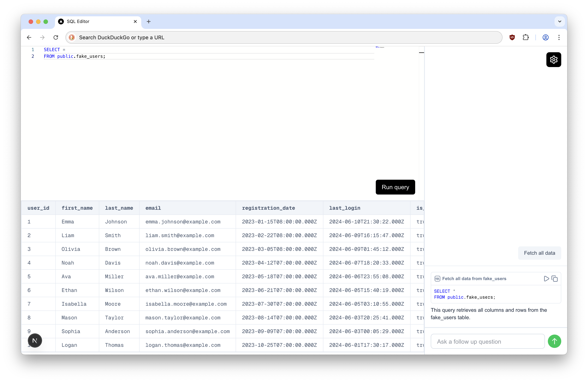

# Fullstack PostgreSQL Editor with AI Assistance

### Given Spec

1. SQL editor can run a SQL query on a postgres database
2. Al has the context of the schema of the postgres database (not the actual data)
3. you can have a conversation with Al chat, and chat can suggest SQL queries
4. the SQL queries surfaced in the ai chat should have 2 buttons on them

    a. run (replaces the SQL query in the SQL editor)
    
    b. copy (copies SQL editor to clipboard)
5. Al generated queries should be validated (ex: no hallucinated fields or tables should be surfaced to the end user, no queries that are invalid)
6. Al powered autocomplete in the SQL editor, similar to cursor. autocomplete suggestions should come up as long as the user is focused in the SQL editor

### Implementation Notes
Some corners were cut in order to implement the MVP within a reasonable amount of time (~8hr).
- Desktop only. Website is non-functional on mobile.
- Postgres connection is re-established on each request (same with the AI API handler instantiation).
- PostgresURL, AI API key, and DB schema are all stored in the user's cookie
    - Ideally the user would have a session token and their associated data would be on the server.
- Some code is AI generated (eg schema fetching) and doesn't match the rest of the code's style (eg `function` vs `()=>{}`)
- Currently no way for the user to have the app re-fetch the DB schema besides re-entering their Postgres URL or deleting their cookie.